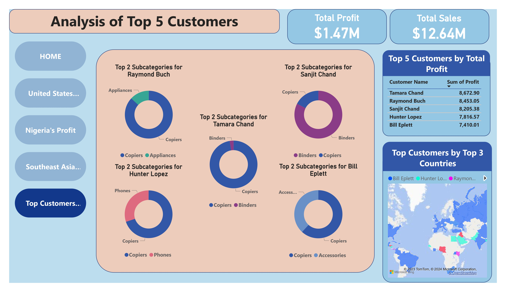

# Global Superstore Analysis Project

## Introduction
This is a Power Bi project on sales analysis on an imaginery **Global Superstore**.
The project is to analyze and answer crucial questions, to enhance performance and profitability, to extract meaningful insights, and help make data driven decision on the Global Superstore Sales.

**_Descailmer_**: _All Datasets report do not represent any company, instuitin or country, but just a practice dataset to demonstrate the capabilities of Power Bi._

## Problem Statement
1. Identifying the top three countries with the highest total profit and their most profitable products in 2014
2. Determining the three subcategories with the highest average shipping cost in the United States
3.Assessing Nigeria's profitability in 2014 compared to other African countries and exploring potential factors influencing its performance
4. Identifying the least profitable product subcategory in Southeast Asia and evaluating whether Global Superstore should discontinue offering it in a specific country within the region
5. Determining the least profitable city in the United States (excluding cities with less than 10 orders) and analyzing the underlying reasons for its low profitability
6. Identifying the product subcategory with the highest average profit in Australia
7. Uncovering the most valuable customers and their purchasing patterns

## Skills Demonstrated
- DAX
- New Measures
- Page Navigation
- Filters
- Tooltips
- Buttons
- Modeling

## Modeling:
This Model is a star schema
The dataset consisted of three tables: Orders, Returns, and People. The Orders table contained the primary data for each transaction, while the Returns and People tables provided supplementary information. The Orders table served as the fact table, linking the other two tables through shared fields.

## Visualization

The report contains 5 pages:
1. Top Performing Countries and Products
2. United States
3. Nigeria's Profit
4. Sub Categories In Southeast Asia
5. Top 5 Customers

You can interact with the report [here](https://app.powerbi.com/reportEmbed?reportId=c01e15d9-88c9-404a-8c9b-0e6964ad7419&autoAuth=true&ctid=517d3502-2901-4de2-a87b-95c507a9a088)

Features:
- The buttons are interactive navigation buttons with page redirection and hover effects.

## Analysis

### Top Performing Countries and Products:
The United States, India, and China emerged as the top three countries with the highest total profit in 2014, with the United States accounting for nearly half of the total profit.

### United States:

High sales volumes in Concord, a US city, were overshadowed by substantial delivery costs and significant discounts, diminishing its overall profitability.

### Nigeria's Profit:

While Nigeria's shipping costs were the lowest among the African countries analyzed, its high average discount rate contributed to its lowest profitability.

### Sub Categories In Southeast Asia:

Indonesia emerged as the country where the "Tables" sub-category incurred significant losses, suggesting a potential discontinuation of this product in that market.

### Top 5 Customers:

The top five customers demonstrated diverse purchasing patterns, with varying preferences for product subcategories.

## Conclusion and Recommendations

Our comprehensive analysis of the Global Superstore dataset yielded valuable insights into the company's sales performance, profitability, and customer behavior. We identified key factors that influence profitability, such as shipping costs, discounts, and product category preferences. By addressing these factors and implementing strategic changes, Global Superstore can enhance its overall profitability and strengthen its position in the global marketplace.

### Recommendations:
- Optimize pricing and cost structure: Review pricing strategies and address high shipping costs and discounts, particularly in markets like the United States and Nigeria. Consider implementing region-specific pricing policies and optimizing shipping routes to reduce costs.
- Reevaluate product offerings: Evaluate product profitability at a granular level, considering both sales volume and profit margins. Discontinue or modify products with low profitability, such as the "Tables" subcategory in Indonesia.
- Focus on high-profit markets: Prioritize business expansion in countries like the United States, India, and China, which consistently contribute significantly to overall profitability
- Target high-value customers: Develop targeted marketing campaigns to attract and retain top-spending customers. Understand their preferences and purchasing patterns to offer personalized recommendations and promotions.
- Leverage data-driven decision-making: Continuously monitor sales trends, profitability metrics, and customer behavior using data analytics tools. Utilize these insights to make informed decisions about product assortment, pricing strategies, and marketing campaigns.

By implementing these recommendations, Global Superstore can optimize its business operations, enhance its profitability, and establish a competitive edge in the global retail landscape.
